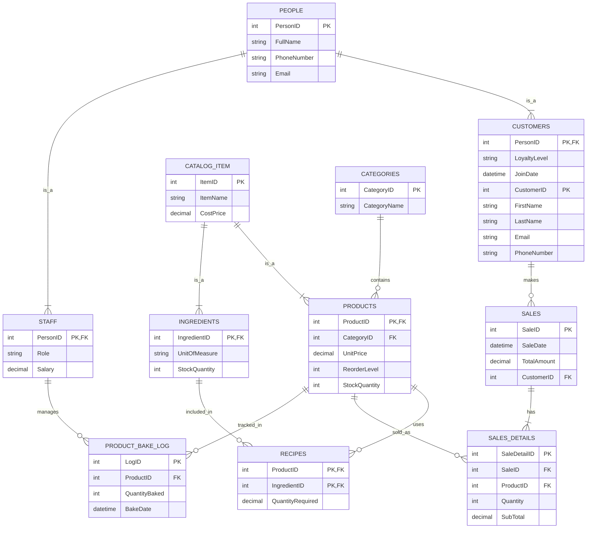

# Wasana Bakers - EER Diagram

This diagram represents the logical structure of your database, including entities, their attributes, and the relationships between them.

## Generalization & Specialization in Wasana Bakers

To meet advanced database requirements, I have implemented two hierarchies:

### 1. People Hierarchy (Generalization)
*   **Supertype: PEOPLE**: Contains common attributes like `PersonID`, `Name`, and `ContactInfo`.
*   **Subtype: CUSTOMERS**: Inherits from People but adds `LoyaltyLevel`.
*   **Subtype: STAFF**: Inherits from People but adds `Role` and `Salary`.
*   **Benefit**: This avoids repeating name and contact columns in two different tables.

### 2. Catalog Items Hierarchy (Generalization)
*   **Supertype: CATALOG_ITEM**: Contains shared data for anything the bakery tracks (Name, Cost).
*   **Subtype: PRODUCTS**: Finished goods sold to customers.
*   **Subtype: INGREDIENTS**: Raw materials used in production.
*   **Benefit**: Centralizes the naming and cost-tracking of all items in the bakery.

## Key Relationships Explained:
1. **Products & Categories**: Many-to-One. Each product belongs to one category, but a category can have many products.
2. **Products & Ingredients (via Recipes)**: Many-to-Many. A product (like a Cake) uses many ingredients, and one ingredient (like Flour) can be used in many products.
3. **Sales & Customers**: One-to-Many. A customer can have many sales, but a sale is linked to one customer (or is a walk-in).
4. **Sales & Products (via SalesDetails)**: Many-to-Many. A sale can contain multiple products, and a product can appear in multiple sales.
5. **Production Management**: The `PRODUCT_BAKE_LOG` now tracks which `STAFF` member was responsible for the baking session.
