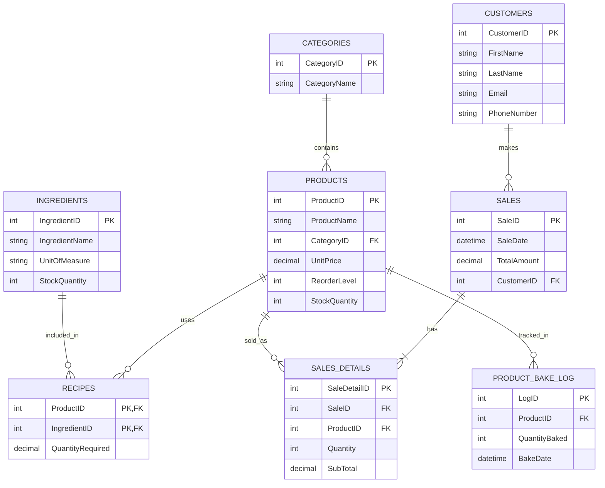

# Wasana Bakers - EER Diagram

This diagram represents the logical structure of your database, including entities, their attributes, and the relationships between them.

## Key Relationships Explained:
1. **Products & Categories**: Many-to-One. Each product belongs to one category, but a category can have many products.
2. **Products & Ingredients (via Recipes)**: Many-to-Many. A product (like a Cake) uses many ingredients, and one ingredient (like Flour) can be used in many products.
3. **Sales & Customers**: One-to-Many. A customer can have many sales, but a sale is linked to one customer (or is a walk-in).
4. **Sales & Products (via SalesDetails)**: Many-to-Many. A sale can contain multiple products, and a product can appear in multiple sales.
5. **Product Bake Log**: Tracks whenever a product is baked, which triggers the inventory updates you implemented!
